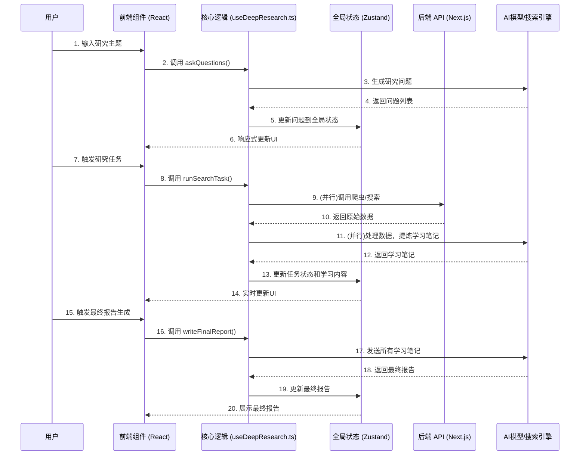

# “深度研究”功能技术分析文档

本文档深入剖析了 `DeepResearch-Email` 项目中“深度研究”功能的核心技术架构、数据流和实现逻辑，旨在为后续的开发、重构或功能迁移提供清晰的技术参考。

## 1. 核心技术栈

- **前端框架**: Next.js (React)
- **状态管理**: Zustand (`zustand`)
- **UI 组件库**: Shadcn UI (`@radix-ui/react-*`, `tailwindcss`)
- **AI SDK**: Vercel AI SDK (`ai`)
- **核心逻辑封装**: React Hooks (`useDeepResearch.ts`)
- **后端 API**: Next.js API Routes (Edge Functions)

## 2. 整体架构与数据流

项目采用现代前端架构，通过 Hooks 和全局状态管理实现了业务逻辑与 UI 的高度解耦。其核心数据流如下：

## 3. 关键模块详解

### 3.1. 前端交互层 (`src/components/Research/`)

- **职责**: 负责所有与“深度研究”相关的用户界面展示和用户输入捕获。
- **关键组件**:
    - `Topic.tsx`: 用户输入初始研究主题的入口。
    - `SearchResult.tsx`: 展示迭代的研究任务列表、进度和结果。
    - `FinalReport.tsx`: 展示最终生成的研究报告。
- **特点**: 组件本身不包含复杂的业务逻辑，仅通过调用 Hooks 来触发功能，并通过订阅 Zustand 来响应式地更新界面。

### 3.2. 核心逻辑层 (`src/hooks/useDeepResearch.ts`)

- **职责**: 项目的“大脑”，封装了所有核心业务逻辑，包括状态管理、API 调用和与 AI 的交互。
- **关键函数**:
    - `askQuestions()`: 根据用户主题，调用 AI 生成初步研究问题。
    - `runSearchTask()`: 并发执行所有研究任务。它会根据配置，调用后端 API 获取网页数据，然后将数据喂给 AI 进行处理和总结。
    - `reviewSearchResult()`: 在一轮研究结束后，调用 AI 对现有结果进行审阅，并提出更深层次的新问题，实现研究的迭代深化。
    - `writeFinalReport()`: 将所有任务的“学习笔记”汇总，调用 AI 生成最终的结构化报告。

### 3.3. 后端 API 层 (`src/app/api/`)

- **职责**: 提供稳定、可靠的后端服务，主要用于解决前端无法直接处理的问题。
- **关键路由**:
    - `api/crawler/route.ts`: 核心功能是作为网络爬虫。它接收前端指定的 URL，在服务端发起 `fetch` 请求，从而完美地绕过了浏览器的 CORS（跨域资源共享）限制。它被部署为 Vercel Edge Function，保证了全球范围内的低延迟访问。

### 3.4. AI 集成与 Prompt Engineering

- **核心驱动力**: AI 是信息处理和知识创造的核心引擎。
- **实现方式**:
    - **Vercel AI SDK**: 提供了统一、简洁的 API 来与不同的 AI 大模型进行流式交互。
    - **Prompt Engineering**: 项目的精髓在于 `src/utils/deep-research/prompts.ts` 中定义的一系列 Prompt。这些精心设计的指令在研究的每个阶段精确地指导 AI 完成特定任务（如分解主题、总结资料、提出新问题、撰写报告），将 AI 从一个简单的聊天机器人，转变为一个强大的、自动化的研究分析引擎。

## 4. 结论与后续开发建议

当前项目是一个功能强大、架构清晰的**前端 Web 应用**。其核心价值在于**人机交互**和**研究过程的可视化**。

对于您“深度研究并发送邮件”的核心需求，该项目提供了**一套完整且经过验证的后端逻辑**，尤其是在 `useDeepResearch.ts` 中封装的、通过 Prompt 将研究任务自动分解、执行、迭代和总结的流水线。

**建议**:
- **保留核心逻辑**: `useDeepResearch.ts` 中与 AI 交互的逻辑，以及 `prompts.ts` 中的 Prompt 设计，是这个项目的精华，应在后续开发中予以保留和复用。
- **剥离 UI**: 对于自动化的后端任务，`src/components` 下的所有 UI 组件、`tailwindcss` 等前端相关的依赖都可以被安全地移除。
- **迁移至后端脚本**: 可以新建一个轻量级的 Node.js 项目，将 `useDeepResearch.ts` 的逻辑迁移过去，并使用 `nodemailer` 等库来替代原有的 UI 展示，实现邮件发送功能。

这份文档为您提供了一个坚实的基础，无论您选择重构还是新建，都可以确保新方案能够继承当前项目最核心、最有价值的部分。